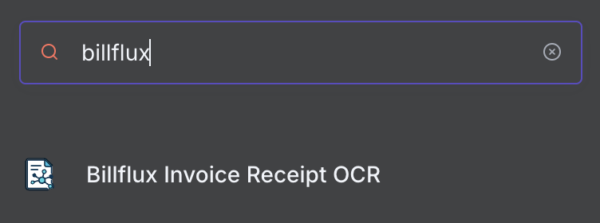
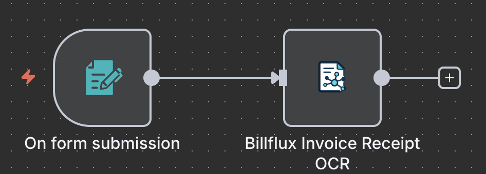
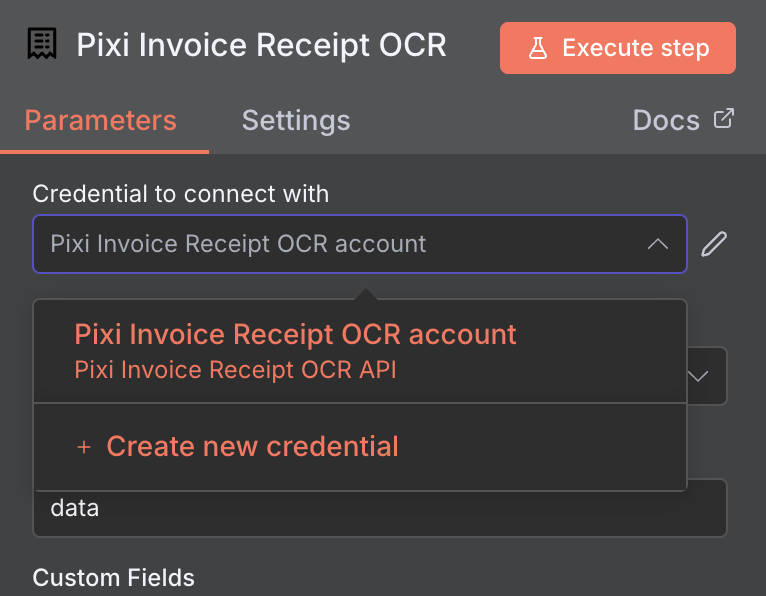
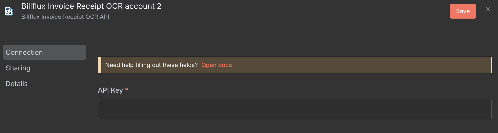
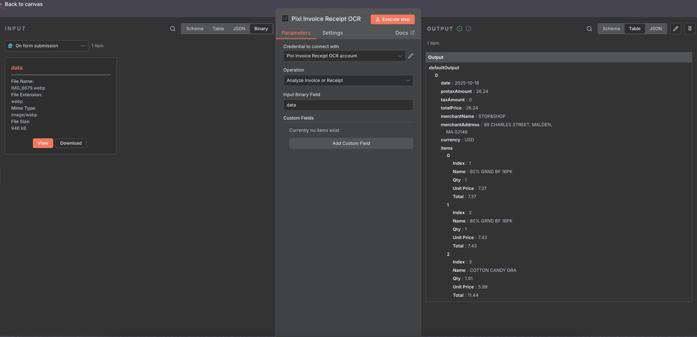

# n8n-nodes-billflux-invoice-receipt-ocr

This is an n8n community node for the Billflux Invoice Receipt OCR API. It extracts clean, structured data from invoices and receipts by leveraging both traditional OCR models and LLM-driven semantic understanding, allowing each technique to contribute its strengths. The result is fast, reliable parsing that works well for automated accounting, bookkeeping, and document-processing workflows.

## Installation

Follow the [installation guide](https://docs.n8n.io/integrations/community-nodes/installation/) in the n8n community nodes documentation.


## Credentials

You must have a RapidAPI account with access to the Billflux Invoice Receipt OCR API to use this node.

### Getting Your API Key:

1. Sign up for a RapidAPI account: https://rapidapi.com/
2. Subscribe to the Billflux Invoice Receipt OCR API: https://rapidapi.com/fadacaioffical/api/billflux-invoice-receipt-ocr

3. Find your API key in the RapidAPI dashboard under "X-RapidAPI-Key"


## Usage

### Basic Workflow

1. Add the **Billflux Invoice Receipt OCR** node to your workflow


2. Connect a node that provides binary file data (e.g., "n8n on form submission", "Google Drive")



3. Open your Billflux Node and create new credential



4. Fill in the API key you obtained from previous step, and save. 


4. Choose the operation: **Analyze Invoice or Receipt**

5. Specify the binary property name containing your file (default: `data`)
6. (Optional) Add custom fields for additional extraction instructions
7. Execute the workflow



### Supported File Formats

- PDF
- JPG/JPEG
- PNG
- HEIC
- GIF
- WEBP

### Custom Fields Feature

The node supports custom field extraction where you can specify additional fields to extract from your invoices/receipts:

1. Click **Add Custom Field** under Custom Fields
2. Enter the **Name** (e.g., "Buyer", "warnings", "company_name")
3. Enter the **Description** (e.g., "buyer of the product", "any explosive or dangerous product")
4. Add as many custom fields as needed, but excessive amount of attributes may cause degraded performance


**Example:**
- Name: `Buyer` | Description: `buyer of the product`
- Name: `warnings` | Description: `any explosive or dangerous product`

### Limitation & ToDo
Currently, only single page documents/images are supported, multipage support coming soon

## API Resources

For complete API documentation, visit:

https://rapidapi.com/fadacaioffical/api/billflux-invoice-receipt-ocr

## Example Workflows

### Invoice Processing Pipeline
```
[Google Drive] → [Billflux Invoice Receipt OCR] → [Google Sheets]
```
Extract invoice data from Google Drive and save to spreadsheet


## License

[MIT](https://github.com/n8n-io/n8n-nodes-starter/blob/master/LICENSE.md)